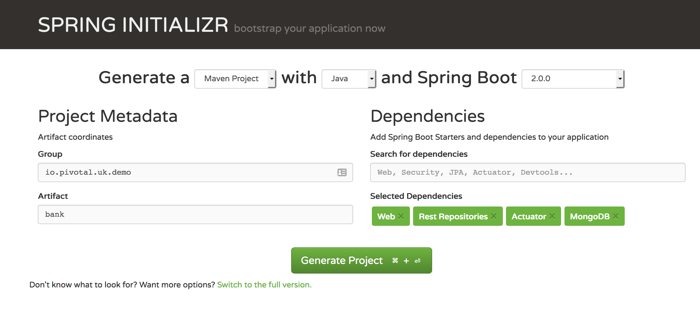

# PKS Demonstration
This is a document to accompany the PKS demonstration which took place on the 28th March 2018 in Pivotal London.

There are five steps:

1. [Create a PKS cluster](#step1-createapkscluster)
2. [Install and configure helm](#step2-installandconfigurehelm)
3. [Install MongoDB](#step3-installmongodb)
4. [Create a user-provided service in Pivotal Cloud Foundry](#step4-createauser-providedserviceinpivotalcloudfoundry)
5. [Create a Spring Boot app to talk to MongoDB](#step5-createaspringbootapptotalktomongodb)

## Step 1 - Create a PKS Cluster
Note - you can skip this step if you already have a kubernetes environment running.

Review the PKS plans available:

```
% pks plans
```

This will output the available plans, for example:

```
Name    ID                                    Description
small   8A0E21A8-8072-4D80-B365-D1F502085560  Default plan for K8s cluster
medium  58375a45-17f7-4291-acf1-455bfdc8e371  For medium workloads
large   241118e5-69b2-4ef9-b47f-4d2ab071aff5  For large workloads
```

To create a new PKS cluster, pick your plan (for example `small`) and provide it with an external hostname, for example:

```
% pks create-cluster bank -e bank.example.com -p small
```

You can monitor progress by running `pks cluster <cluster-name>`, e.g.

```
% pks cluster bank

Name:                     bank
Plan Name:                small
UUID:                     928206d2-3a4d-4123-b2c0-f8e3ecc0b167
Last Action:              CREATE
Last Action State:        in progress
Last Action Description:  Instance provisioning in progress
Kubernetes Master Host:   bank.example.com
Kubernetes Master Port:   8443
Worker Instances:         3
Kubernetes Master IP(s):  In Progress
```

Once it is complete, grab the credentials:

```
% pks get-credentials bank

Fetching credentials for cluster cn01.
Context set for cluster cn01.

You can now switch between clusters by using:
$kubectl config use-context <cluster-name>
```

PKS will automatically set your `kubectl` context. You can check all is OK:
```
% kubectl cluster-info

Kubernetes master is running at https://bank.example.com
kube-dns is running at https://bank.example.com/api/v1/namespaces/kube-system/services/kube-dns/proxy
```


## Step 2 - Install and configure helm
Install helm (see [helm.sh](https://helm.sh) and install it.

Now you need to create a service account for helm, create a `rbac-config.yaml` file:
```yaml
apiVersion: v1
kind: ServiceAccount
metadata:
  name: tiller
  namespace: kube-system
---
apiVersion: rbac.authorization.k8s.io/v1beta1
kind: ClusterRoleBinding
metadata:
  name: tiller
roleRef:
  apiGroup: rbac.authorization.k8s.io
  kind: ClusterRole
  name: cluster-admin
subjects:
  - kind: ServiceAccount
    name: tiller
    namespace: kube-system
```

Create the service account
```
% kubectl create -f rbac-config.yaml
```

Now initialise helm on the kubernetes cluster:
```
% helm init --service-account tiller
```

This will install `tiller` the kubernetes component of helm.

## Step 3 - Install MongoDB
Use helm to deploy a stable version of MongoDB with some default credentials and database

First set up your environment variables
```bash
export MONGODB_NAME="mongodb"
export MONGODB_ROOT_PW="pivotal123"
export MONGODB_DATABASE="pivotal"
export MONGODB_USERNAME="pivotal"
export MONGODB_PASSWORD="pivotal123"
export MONGODB_SERVICETYPE="LoadBalancer"
```
Change these based on your own needs, but note the `MONGODB_SERVICETYPE` is LoadBalancer which means the underling IaaS (e.g. GCP, NSX-T) will create a load balancer for you

Create a mongodb installation
```bash
% helm install --name $MONGODB_NAME --set mongodbRootPassword=$MONGODB_ROOT_PW,mongodbUsername=$MONGODB_USERNAME,mongodbPassword=$MONGODB_PASSWORD,mongodbDatabase=$MONGODB_DATABASE stable/mongodb
```

Check the status:
```
% kubectl get services

NAME             CLUSTER-IP       EXTERNAL-IP   PORT(S)   AGE
mongodb-mongodb  10.0.0.50        x.x.x.x       27017/TCP 24s
kubernetes       10.0.0.1         <none>        443/TCP   27m
```

Note the external IP, if it's `<Pending>` give it a few seconds (a few minutes in some cases) to get one.

```bash
# Change x.x.x.x to your MongoDB External IP
export MONGODB_HOST=x.x.x.x
# Create a URI for MongoDB
export MONGODB_URI="mongodb://$MONGODB_USERNAME:$MONGODB_PASSWORD@$MONGODB_HOST/$MONGODB_DATABASE"
```

Now initalise your mongodb database (you need MongoDB installed) with the `customer.json` included in this repository:

```bash
mongoimport --uri $MONGODB_URI --file customer.json
```

## Step 4 - Create a user-provided service in Pivotal Cloud Foundry
A [user provided service](https://docs.cloudfoundry.org/devguide/services/user-provided.html) in Cloud Foundry is a way to quickly bind an external service without a service broker.

To create one for MongoDB simply run:
```bash
% cf create-user-provided-service mongodb -p '{ "uri": "'$MONGODB_URI'" }'
```

## Step 5 - Create a Spring Boot app to talk to MongoDB
Note - this demo is included in this repository

Visit [start.spring.io](https://start.spring.io) and create a new project called `bank` with the following dependencies:

1. Web
2. Rest Repositories
3. Actuator
4. MongoDB



Download the project in to the IDE of your choice.

Create a new class `Customer` the folowing data:
```java
package io.pivotal.uk.demo.bank;

import org.springframework.data.annotation.Id;

public class Customer {
	@Id
	private String id;
	private String customerName;
	private String accountNumber;

	public String getId() {
		return id;
	}

	public void setId(String id) {
		this.id = id;
	}

	public String getCustomerName() {
		return customerName;
	}

	public void setCustomerName(String customerName) {
		this.customerName = customerName;
	}

	public String getAccountNumber() {
		return accountNumber;
	}

	public void setAccountNumber(String accountNumber) {
		this.accountNumber = accountNumber;
	}

}
```

Now create an interface `CustomerRepo` like this:

```java
package io.pivotal.uk.demo.bank;

import org.springframework.data.mongodb.repository.MongoRepository;

public interface CustomerRepo extends MongoRepository<Customer, String> {

}
```

Compile the code:
```
% mvn package -DskipTests
```

Push it to Cloud Foundry, but don't start it:
```
% cf push -p target/bank-0.0.1-SNAPSHOT.jar bank --no-start
```
Now bind your mongodb service:
```
% cf bind-service bank mongodb
```
Start the app:
```
% cf start bank
```

Tada! You have a working Spring Boot app talking to MongoDB!